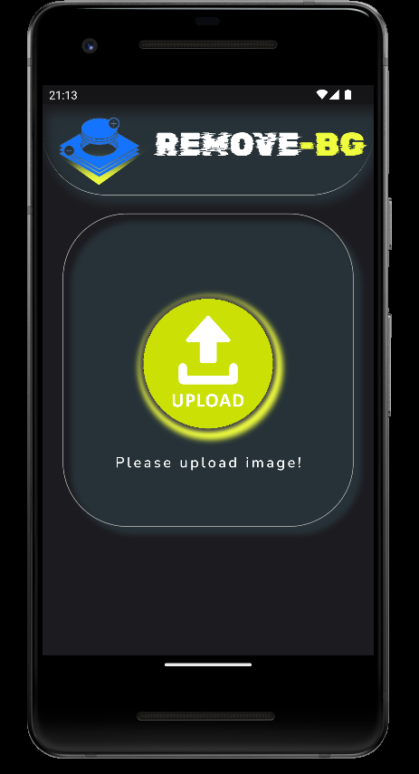
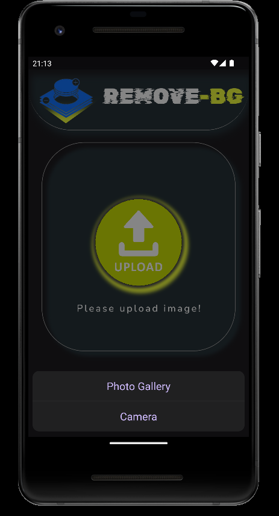
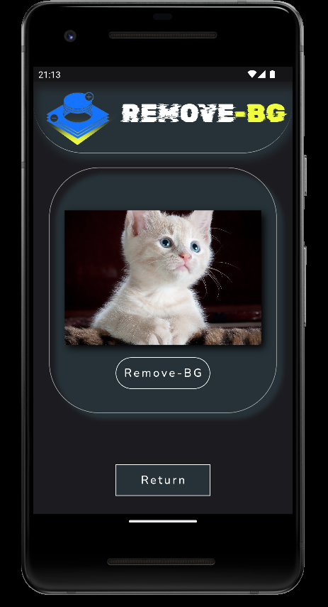
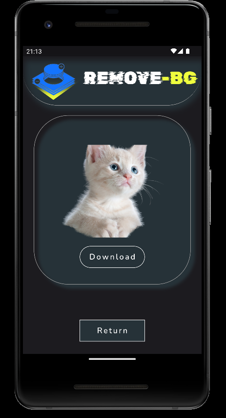
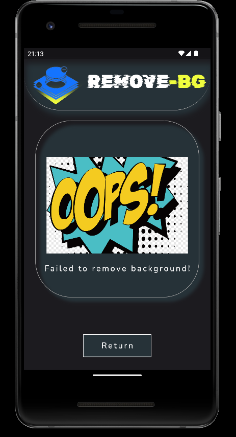

# ***REMOVE BG***

  

<b>-> You can remove the background of your photos with this application.!</b>
  

-> Choose where to add the photo (camera/gallery)... 
-> Click the remove bg button. 
-> The background of your photo will be removed in seconds!

   

    

 
 

    <b>Choose one:</b>  w
     

    <b>Choose your photo:</b>  
     

    <b>Remove BG:</b>  
     

    <b>Not suitable for RemoveBG:</b> 
     

